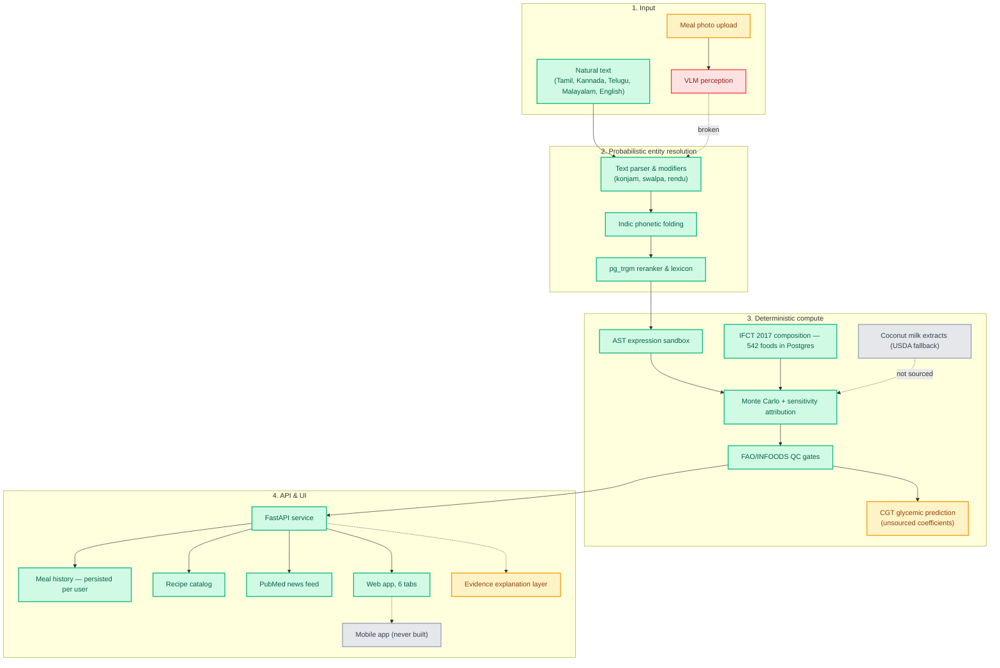

# Pathyam — Clinical Nutrition & Glycemic Engine

Pathyam computes the nutrient content of South Indian meals from **parametric recipe templates** rather than static lookup rows. A dish is a set of parameters (batter mass, oil quantity, fermentation hours) with prior distributions; the engine samples them, walks nested sub-recipes, applies cooking yield and retention factors, and returns every nutrient as an **80% credible interval** with its sources and confidence tier attached.

That is the product. Everything else is in service of it.

---

## Status

The compute core is real and tested. Several surrounding features are scaffolding that does not yet do what its name suggests, and this README says which is which. Read the **Known gaps** table before quoting any capability.

### Working

| Component | Evidence |
|---|---|
| **Monte Carlo compute engine** | Nested sub-recipe walking, deterministic seeding, Spearman + eta-squared sensitivity attribution, per-nutrient confidence tracking that flags borrowed values. `pathyam_engine/engine.py` |
| **AST expression sandbox** | Whitelisted evaluator over `qty_expr` strings from the database. Rejects attribute access, subscripts, comprehensions, starred args; bounds expression length and node count; traps non-finite results. Documented as a security boundary. `pathyam_engine/expressions.py` |
| **FAO/INFOODS QC gates** | 10 gates: proximate sum, Atwater energy reconciliation, fatty acids ≤ total fat, sugars ≤ carbohydrate, yield plausibility, interval ordering and width, composition coverage, confidence floor. `pathyam_engine/qc.py` |
| **Dish resolution** | Indic phonetic folding across Tamil, Kannada, Telugu, Malayalam and Hindi, modifier parsing (*konjam*, *swalpa*, *rendu*), pg_trgm reranking. Measured below. |
| **Resolution eval harness** | 145 hand-written golden queries including deliberate abstain and absent cases, held-out ablation, abstention calibration. `pathyam_engine/evaluation/harness.py` |
| **Recipe compiler** | State machine over authored templates: DRAFT → RESOLUTION_REQUIRED / MISSING_COMPOSITION / MISSING_QUANTITY / QC_FAILED → COMPUTABLE → VALIDATED. `pathyam_engine/compiler.py` |
| **IFCT 2017 composition** | The published ICMR-NIN table: 542 foods, real IFCT codes, 19,999 analytical values with per-value standard errors, 1,341 native-language names (ta/te/ml/kn). Fetched by `scripts/fetch_ifct.py`, ingested by `authoring/ifct2017.py`. **16 of 17 templates compute (94%).** |
| **Derived composition** | Foods IFCT has no row for: borrowed from a parent food (tier C, `is_borrowed`) or fixed by chemistry (tier B, derivation recorded). `authoring/derived_foods.py` |
| **Meal journal** | Persisted to `app.meal_log` / `app.meal_log_item`, per user, soft-deleted. Survives restart. |
| **REST API** | `/v1/resolve`, `/v1/compute`, `/v1/log`, `/v1/history`, `/v1/templates`, `/v1/news/rss`, `/v1/evidence/explain`. |
| **PubMed news feed** | Live NCBI E-utilities query — real titles, journals, dates, abstracts and PMIDs. Returns an empty feed when NCBI is unreachable. |
| **Web UI** | Single-page app, 6 tabs, served same-origin from `pathyam_api/static/`. Relative API paths throughout. |

### Known gaps

These are **not** working. They exist in the codebase and have endpoints, which is exactly why they are listed here.

| Gap | What actually happens | Planned |
|---|---|---|
| **Meal photo vision** | The configured model id `gemini-3.7-flash` is not a real Gemini model. Any live call fails, and the failure is swallowed — the provider returns a **hardcoded dosa-and-sambar observation** that the caller cannot distinguish from a real reading. | Phase 4 |
| **`/v1/perception/analyze`** | Never reads the uploaded image. Defaults to `"masala dosa"` and returns a fixed bounding box and confidence. | Phase 4 |
| **Authentication** | There is none. `X-Pathyam-User` is an unverified, self-asserted header — it makes the persistence layer genuinely per-user, but it is not a credential and anyone who can reach the API can claim any user. | Phase 6 |
| **Appam template** | Blocked on coconut milk first/second extract, which IFCT 2017 does not carry. These are preparations whose composition depends on the kernel-to-water ratio; picking one would be inventing the number. Next source is USDA FoodData Central (public domain), per the dossier's documented fallback order. | Phase 2 |
| **Evidence retrieval** | `search_semantic` returns `search_lexical` unchanged — there is no pgvector and no Postgres FTS, so reciprocal rank fusion merges two identical rankings. The corpus is 3 documents in a Python list. | Phase 5 |
| **Citation validation** | Confirms an identifier *resolves*; does not confirm the resolved record is the work being cited. A fabricated citation with a real-but-unrelated PMID passes. One shipped in this corpus and was removed in Phase 1. | Phase 5 |
| **CGT glycemic prediction** | `predict_spike` coefficients (1.8, −0.02, −0.04) have no cited derivation. The curve shape and trapezoidal iAUC are correctly implemented; the constants are not sourced. **Do not present its output as clinical guidance.** | Phase 6 |
| **`/v1/cgt/telemetry`** | Echoes its input. Stores nothing, used by nothing. | Phase 6 |
| **Safety benchmarks** | The suite computes correctly, but **no golden meal dataset exists** — the only samples are two synthetic rows in a unit test. It has nothing to measure. | Phase 4 |
| **Mobile app** | `apps/mobile` has never been installed or built and has no lockfile. Expo 51 / React Native 0.74. | Phase 6 |

---

## Measured performance

Resolution is the only subsystem with a trustworthy number, because it is evaluated against a held-out lexicon with 65 aliases removed.

```bash
cd engine && PYTHONPATH=. python3 -m pathyam_engine.evaluation
```

145 queries · 262 lexicon entries · median 2.68 ms/query

| Metric | Held-out |
|---|---|
| top-1 | **83.3%** |
| top-5 | **92.0%** |
| MRR | **0.867** |

By category, top-1: exact English, native Tamil/Kannada/Telugu/Malayalam, code-mixed, ambiguous and modifier queries all **100%**; with-quantity **92.3%**; misspellings **81.2%**; colloquial **68.8%**; **romanised 53.3%**.

Romanised input is the largest category (30 queries) and the weakest — and romanised Tamil, Telugu, Kannada and Malayalam is how most users will actually type. That is the open engineering problem.

Abstention is well calibrated: 39.3% of queries ask for confirmation, 35.1% of those would otherwise have been wrong, only 3.4% are confident mistakes, and recall on cases the golden set marks "should ask" is 100%. Weak spot: 28.6% of genuinely absent dishes are still offered a candidate.

---

## Architecture



The separation between resolution and computation is load-bearing: `/v1/resolve` cannot return a nutrient value and `/v1/compute` cannot guess a dish, so no response can contain a number that did not come out of the engine's arithmetic.

---

## Running

### Test suite

```bash
./engine/run_tests.sh
```

Current result: **283 tests passing** — 217 unit, 66 integration/API. The integration suite seeds a throwaway Postgres from `db/` via `pgserver`; no Docker and no root required.

### Development server

```bash
cd engine && ./dev.sh
```

Serves on `http://127.0.0.1:8000/`. No authentication, no rate limiting, no request logging — bound to loopback deliberately. Do not expose it.

### Configuration

Copy `.env.example` to `.env`. `ALLOWED_ORIGINS` is required in production: when it is unset and `PATHYAM_ENV != development`, the CORS allowlist is **empty**, not `*`. Credentials are enabled, so a wildcard is never valid.

---

## Multi-platform

The web UI in `engine/pathyam_api/static/` is a single HTML/CSS/JS application with a PWA manifest and service worker, intended to be wrapped for iOS and Android rather than reimplemented. `apps/mobile` is an Expo scaffold toward that; it has not been built.

---

## Development phases

1. **Restore trust** — fix the build, remove fabricated data and uncomputed metrics, make the docs match the code. *(complete)*
2. **Real data spine** — *done, bar one template.* Real IFCT 2017 ingested (542 foods, 19,999 values); journal persisted per user; water conservation bug found and fixed. Appam still needs a coconut-milk source.
3. **Close the resolution gap** — romanised top-1 from 53.3% to ≥80%.
4. **Earn the perception layer** — correct the model id, fail loudly, collect a golden meal dataset, publish measured portion error.
5. **Earn the evidence layer** — validate citations by title/author agreement, build a real corpus, implement both retrieval arms.
6. **Clinical validation** — source or relabel the CGT model, multi-user foundations, ship a mobile build.
