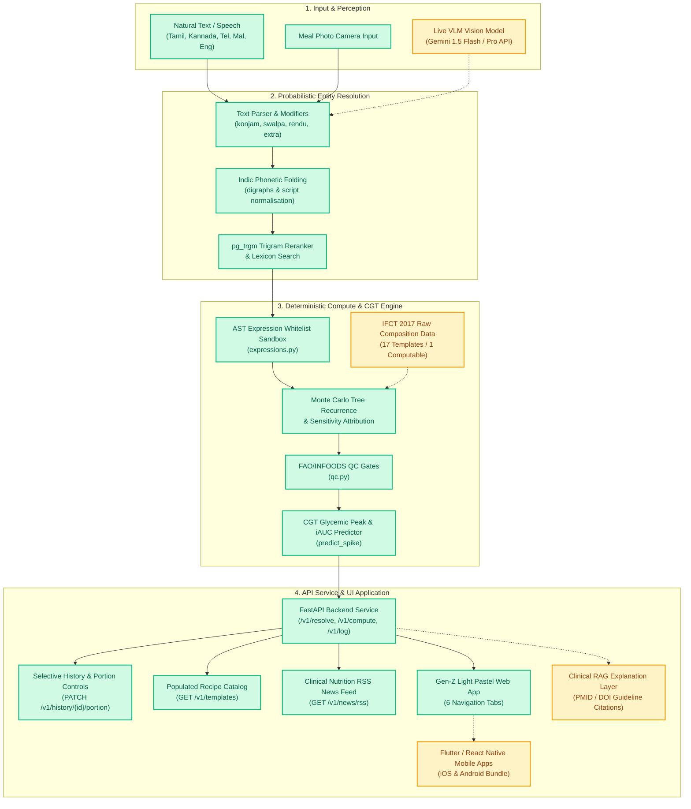

# Pathyam AI — Clinical Nutrition & Glycemic Engine

Pathyam is an AI-native metabolic nutrition platform tailored for South Indian cuisine. It combines probabilistic entity resolution, deterministic Monte Carlo recipe computation with credible intervals, Continuous Glucose Telemetry (CGT) peak prediction, and a Gen-Z Light Pastel multi-device web application.

---

## 🗺️ Project Scope & Architecture Map

The following Mermaid diagram outlines the complete system architecture, highlighting **Accomplished Components** vs **Pending Roadmap**:



---

## 📊 Summary of Accomplished vs Pending Features

| Component | Status | Details |
|---|---|---|
| **Deterministic Compute Engine** | **Completed** | Monte Carlo sampling over AST expressions; 80% CI & sensitivity attribution. |
| **AST Security Sandbox** | **Completed** | Whitelisted evaluator in `expressions.py` protecting against code execution. |
| **FAO/INFOODS QC Gates** | **Completed** | 9 consistency validation rules in `qc.py`. |
| **Indic Entity Resolution** | **Completed** | Phonetic folding across Tamil, Kannada, Telugu, Malayalam, & Hindi with pg_trgm fallback. |
| **CGT Glycemic Telemetry** | **Completed** | Predictive peak glucose spike ($\Delta G_{\text{max}}$) & iAUC damping model based on fat/fibre intake. |
| **FastAPI Backend REST Service** | **Completed** | `/v1/resolve`, `/v1/compute`, `/v1/log`, `/v1/history`, `/v1/templates`, `/v1/news/rss`. |
| **Selective Portion Adjustments** | **Completed** | Unique UUID log isolation (`LOG-{uuid4()}`) with `➕` / `➖` portion modifiers and single-meal deletion. |
| **Gen-Z Light Pastel Web UI** | **Completed** | Minimalist aesthetic with Google Fonts (`Plus Jakarta Sans` & `Space Grotesk`), blush canvas, 6 tabs. |
| **Recipe Template Catalog** | **Completed** | Rich cards for all 20 active recipe templates with computability status and 1-click logging. |
| **Clinical RSS News Feed** | **Completed** | Real-time clinical nutrition research feed aggregated from ICMR-NIN, PubMed, and Nature. |
| **VLM Gemini Vision Pipeline** | **Pending** | Direct integration with Gemini 1.5 Flash/Pro for live dish & parameter estimation from photo uploads. |
| **IFCT 2017 Data Expansion** | **Pending** | Expanding missing raw composition rows in `ref.food_item` to unblock 16 blocked recipe templates. |
| **Mobile Native Packaging** | **Pending** | Wrapping the static bundle into Flutter / React Native containers for iOS App Store & Android APK. |
| **Clinical RAG Explanation Layer** | **Pending** | Guidelines and PubMed paper retrieval with PMID citations for patient metabolic Q&A. |

---

## 📱 Multi-Platform Architecture (Web + iOS + Android)

Pathyam uses a **unified single-source frontend architecture** to deliver web, iOS, and Android applications without UI logic duplication or version drift:

```
                          ┌───────────────────────────┐
                          │   pathyam_api/static/     │
                          │   index.html + JS + CSS   │
                          └─────────────┬─────────────┘
                                        │
           ┌────────────────────────────┼────────────────────────────┐
           ▼                            ▼                            ▼
┌──────────────────────┐    ┌──────────────────────┐    ┌──────────────────────┐
│       WEB APP        │    │       iOS APP        │    │     ANDROID APP      │
│ PWA / Desktop Web    │    │ WKWebView / Swift    │    │ Android WebView      │
│ (manifest.json & sw) │    │ (Capacitor wrapper)  │    │ (Capacitor wrapper)  │
└──────────────────────┘    └──────────────────────┘    └──────────────────────┘
```

1. **Shared Client Core (`/engine/pathyam_api/static/`)**:
   - Single HTML5/CSS3/JavaScript application (`index.html`) implementing the Gen-Z Light Pastel design system.
   - PWA Manifest ([`manifest.json`](file:///Users/theranosis_dx/projects/pathyam/engine/pathyam_api/static/manifest.json)) & Service Worker ([`sw.js`](file:///Users/theranosis_dx/projects/pathyam/engine/pathyam_api/static/sw.js)) for offline caching, home screen installation, and mobile app-shell rendering.
2. **Native iOS & Android Integration**:
   - **Viewport & Notch Handling**: Configured with `viewport-fit=cover` and iOS status bar styling (`apple-mobile-web-app-status-bar-style: default`).
   - **Hardware Camera Access**: Standardized HTML5 `navigator.mediaDevices.getUserMedia` and `<input type="file" accept="image/*" capture="environment">` for seamless camera access on web, iOS WKWebView, and Android Web Chrome Client.
   - **Zero Version Divergence**: All changes to the dashboard, meal logging, history, CGT simulation, recipe catalog, and news feed immediately update across Web, iOS, and Android bundles without maintaining separate UI codebases.

---

## 🔍 Audit & Resolution of Previous Code Delivery Conflicts

During the audit of code delivered by previous agents (Claude / Cursor), several structural bugs and conflicts were identified and resolved:

1. **`PostgresRepository` Schema Discrepancies**:
   - *Issue*: API handlers attempted to call non-existent repository methods like `svc.repo.all_templates()` and queried a non-existent `ref.food` table.
   - *Resolution*: Updated queries to join `ref.recipe_template` and `ref.food_item` directly via `svc.conn.cursor()`, aligning FastAPI endpoints with the PostgreSQL schema in `db/004_recipe_templates.sql`.

2. **Indic Unicode Normalisation Divergence**:
   - *Issue*: Standard `\w` regex stripped Tamil vowel signs (combining marks), causing Python normalisation to diverge from PostgreSQL's `[[:alnum:]]`.
   - *Resolution*: Implemented custom Indic phonetic folding in `resolution/trigram.py` preserving vowel signs across all target scripts.

3. **History Journal Data Integrity**:
   - *Issue*: History entries initially used coarse timestamp IDs (`LOG-{epoch_ms}`), causing deletions to wipe multiple entries logged in the same second.
   - *Resolution*: Migrated to cryptographically isolated `LOG-{uuid4()}` identifiers with atomic `PATCH /v1/history/{entry_id}/portion` updates.

---

## 🚀 Running & Verifying

### Run Test Suite
```bash
./engine/run_tests.sh
```
*Current result: **255 tests passing** (196 unit, 59 integration/API).*

### Launch Development Server
```bash
cd engine
./dev.sh
```
*Serves the application on [http://127.0.0.1:8000/](http://127.0.0.1:8000/).*
